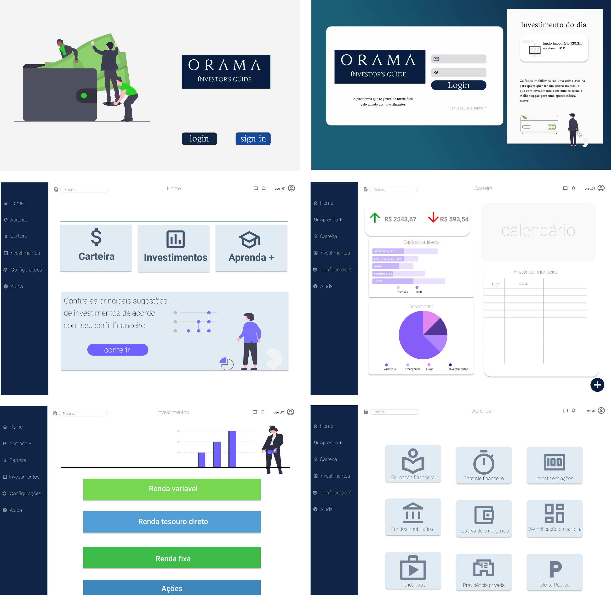

# Órama Investidor's Guide

## Presentation

**The Órama Investidor's Guide** was developed during [MegaHack](https://www.megahack.com.br/) 5th edition. Among the challenges available at the event, we from team 2 "o quarteto fantástico" chose the [Órama investimentos](https://www.orama.com.br/) challenge. 

The description of challenge said: **"Develop a way to present investment products and services in a more user-friendly, simplified way that meets the best user experience practices applied by companies like Netflix and Spotify. The goal is to communicate with the public in a clear way and using less “economics”. "**

From that we had the idea of ​​creating the this! 
Where the platform indicates the types of investments according to the user's profile. In it we insert our expenses and our financial inputs, and from that the platform identifies our financial profile and gives us tips.

Another feature is the possibility to learn more about financial education.

**The application is still in production.**

## What is MEGAHACK

**The biggest online hackathon in Brazil** carried out by [Shawee](https://shawee.io/) could not carry another name, except: MEGA!

Great not only for breaking geographical barriers, but also for the dimension of the journey it provides to its participants. Mega Hack is Mount Everest of the hackathons, and it takes preparation to reach the top.

There will be 11 days, 10 different challenges to choose from and endless possibilities.

---

# Getting Started with Create React App

This project was bootstrapped with [Create React App](https://github.com/facebook/create-react-app).

## Available Scripts

In the project directory, you can run:

### `yarn start`

Runs the app in the development mode.\
Open [http://localhost:3000](http://localhost:3000) to view it in the browser.

The page will reload if you make edits.\
You will also see any lint errors in the console.

